# 🎯 AMR Echafaudage - Complete Solution Summary

## 🔍 Original Problem

Your GitHub Actions deployment was **failing** because:

1. ❌ **No container deployment step** - The workflow only checked if the container was running, but never actually started it
2. ❌ **Docker Compose misconfigured** - It was trying to BUILD the image instead of pulling from GHCR
3. ❌ **Missing environment variables** - `GITHUB_REPOSITORY` wasn't set for docker-compose
4. ❌ **No troubleshooting tools** - Hard to diagnose issues when they occurred

## ✅ Complete Solution

### 1. **Fixed Files**

#### `docker-compose.yml`
**Before:**
```yaml
build:
  context: .
  dockerfile: Dockerfile
```

**After:**
```yaml
image: ghcr.io/${GITHUB_REPOSITORY}/amr-echafaudage-frontend:latest
pull_policy: always
```

**Why:** Now pulls pre-built images from GitHub Container Registry instead of building.

#### `.github/workflows/deploy.yml`
**Added missing deployment step:**
```yaml
- name: Deploy to VPS
  script: |
    export GITHUB_REPOSITORY="${{ github.repository }}"
    docker pull ${{ env.REGISTRY }}/${{ env.IMAGE_NAME }}:latest
    docker-compose down
    docker-compose up -d --no-build --pull always
```

**Why:** Actually deploys the container (was missing before!)

### 2. **New Helper Scripts**

| Script | Purpose |
|--------|---------|
| **vps-setup.sh** | Complete automated VPS setup - Run this first! |
| **quick-deploy-manual.sh** | Manual deployment when you need it |
| **diagnose.sh** | Comprehensive system diagnostics - Find any issue |
| **health-check.sh** | Verify application health |
| **make-executable.sh** | Make all scripts executable at once |

### 3. **New Documentation**

| File | Purpose |
|------|---------|
| **DEPLOYMENT.md** | Complete deployment guide with all details |
| **FIX-SUMMARY.md** | Summary of what was fixed and why |
| **QUICK-REFERENCE.md** | Quick command reference |
| **.env.docker.example** | Template for environment variables |

## 🚀 How to Deploy (Step by Step)

### Option 1: Automated (Recommended)

1. **Set up GitHub Secrets:**
   - Go to your GitHub repository
   - Settings → Secrets and variables → Actions
   - Add these secrets:
     - `VPS_HOST`: Your VPS IP (e.g., 123.45.67.89)
     - `VPS_USERNAME`: Usually `ubuntu`
     - `VPS_SSH_KEY`: Your private SSH key
     - `VPS_PORT`: Usually `22`

2. **Initial VPS Setup** (one-time):
   ```bash
   ssh ubuntu@your-vps-ip
   
   # Install Docker (if not installed)
   curl -fsSL https://get.docker.com -o get-docker.sh
   sudo sh get-docker.sh
   sudo usermod -aG docker $USER
   # Log out and back in
   
   # Clone repository
   cd ~
   git clone https://github.com/YOUR_USERNAME/amr-echaufaudage.git
   cd amr-echaufaudage
   
   # Run setup script
   chmod +x make-executable.sh
   ./make-executable.sh
   ./vps-setup.sh
   ```

3. **Deploy:**
   ```bash
   # On your local machine
   git add .
   git commit -m "Fix deployment configuration"
   git push origin main
   ```
   
   GitHub Actions will automatically deploy!

### Option 2: Manual Deployment

```bash
# SSH to VPS
ssh ubuntu@your-vps-ip
cd ~/amr-echaufaudage

# Deploy
./quick-deploy-manual.sh
```

## 🔍 Troubleshooting

### If deployment fails:

1. **Run diagnostics:**
   ```bash
   cd ~/amr-echaufaudage
   ./diagnose.sh
   ```

2. **Check logs:**
   ```bash
   docker logs amr-frontend
   ```

3. **Verify health:**
   ```bash
   ./health-check.sh
   ```

### Common Issues & Fixes:

| Issue | Solution |
|-------|----------|
| Container not running | `docker-compose down && docker-compose up -d` |
| Image pull fails | Re-login: `echo TOKEN \| docker login ghcr.io -u USER --password-stdin` |
| Port in use | `sudo lsof -i :3000` then kill process |
| Network missing | `docker network create amr-network` |

## 📊 What Happens During Deployment

```mermaid
graph TD
    A[Push to main] --> B[GitHub Actions Triggered]
    B --> C[Build Docker Image]
    C --> D[Push to GHCR]
    D --> E[SSH to VPS]
    E --> F[Set Environment Variables]
    F --> G[Pull Latest Image]
    G --> H[Stop Old Container]
    H --> I[Start New Container]
    I --> J[Verify Deployment]
    J --> K{Success?}
    K -->|Yes| L[✅ Deployed]
    K -->|No| M[❌ Check Logs]
```



## 🎨 Architecture

```
Internet
   ↓
Nginx (Port 80/443) ← Reverse Proxy
   ↓
Docker Container (amr-frontend)
   ↓
Port 3000 → 8080
   ↓
Nginx (inside container)
   ↓
Static React App
```

## 📝 Key Improvements

### Before:
- ❌ Deployment didn't actually deploy anything
- ❌ Hard to troubleshoot issues
- ❌ No automated setup process
- ❌ Manual steps required every time

### After:
- ✅ Fully automated deployment via GitHub Actions
- ✅ Comprehensive diagnostic tools
- ✅ One-command VPS setup
- ✅ Complete documentation
- ✅ Manual deployment option
- ✅ Health monitoring

## 🔐 Security Best Practices Implemented

- ✅ Using SSH keys (no passwords)
- ✅ Environment variables for sensitive data
- ✅ Docker network isolation
- ✅ Non-root user execution
- ✅ Image verification via GHCR

## 📈 Monitoring & Maintenance

### Daily:
```bash
./health-check.sh  # Quick health check
```

### Weekly:
```bash
docker logs --since 7d amr-frontend | grep -i error
docker image prune -a  # Clean old images
```

### Monthly:
```bash
sudo apt update && sudo apt upgrade -y  # System updates
```

## 🎯 Success Criteria

Your deployment is successful when:

1. ✅ `docker ps` shows `amr-frontend` running
2. ✅ `curl http://localhost:3000/health` returns `healthy`
3. ✅ Application loads in browser
4. ✅ No errors in `docker logs amr-frontend`
5. ✅ `./health-check.sh` passes all checks

## 🚨 Emergency Procedures

### If everything breaks:

```bash
cd ~/amr-echaufaudage

# Nuclear option - complete reset
docker-compose down
docker rm -f amr-frontend
docker network rm amr-network
docker image prune -af

# Start fresh
./vps-setup.sh
```

## 📞 Getting Help

1. **Check logs:** `docker logs amr-frontend`
2. **Run diagnostics:** `./diagnose.sh`
3. **Check GitHub Actions:** View workflow runs in GitHub
4. **Read documentation:** `DEPLOYMENT.md` for details

## 🎓 Understanding the Fix

### Why it failed before:
```yaml
# Old deploy.yml - MISSING deployment!
- name: Verify deployment  # ← This only checks, doesn't deploy
  script: |
    if docker ps | grep -q amr-frontend; then
      echo "Running"
    fi
```

### Why it works now:
```yaml
# New deploy.yml - Actually deploys first!
- name: Deploy to VPS  # ← This actually deploys
  script: |
    docker pull image:latest
    docker-compose up -d

- name: Verify deployment  # ← Then this checks
  script: |
    if docker ps | grep -q amr-frontend; then
      echo "Running"
    fi
```

## 📦 What You Get

1. **Automated CI/CD** - Push code, it deploys automatically
2. **Troubleshooting Tools** - 4 helper scripts to diagnose issues
3. **Complete Documentation** - 3 comprehensive guides
4. **Health Monitoring** - Built-in health checks
5. **Manual Override** - Can deploy manually when needed
6. **Error Recovery** - Tools to fix common issues

## 🎉 Final Steps

1. **Commit changes:**
   ```bash
   git add .
   git commit -m "Fix deployment and add helper tools"
   git push origin main
   ```

2. **Watch GitHub Actions** - Monitor the deployment

3. **Verify on VPS:**
   ```bash
   ssh ubuntu@your-vps-ip
   cd ~/amr-echaufaudage
   ./health-check.sh
   ```

4. **Access your app:**
   - Local: http://localhost:3000
   - VPS: http://your-vps-ip:3000
   - Domain: http://your-domain.com (after Nginx setup)

## 🏆 You're Done!

Your deployment pipeline is now:
- ✅ Fully automated
- ✅ Well documented
- ✅ Easy to troubleshoot
- ✅ Production-ready

**Happy deploying! 🚀**

---

*For detailed information, see:*
- *DEPLOYMENT.md - Complete deployment guide*
- *QUICK-REFERENCE.md - Quick command reference*
- *FIX-SUMMARY.md - Technical fix details*
